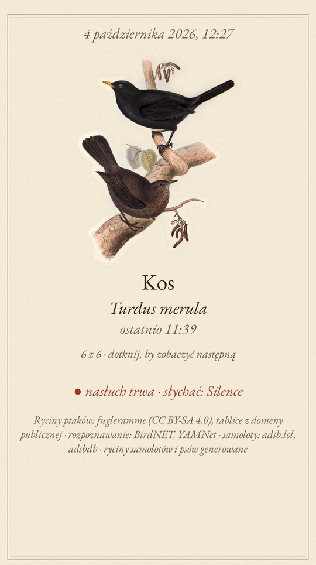
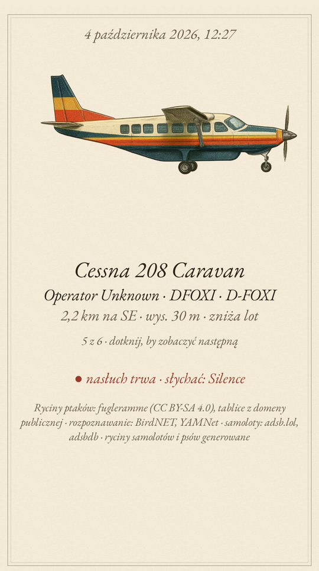
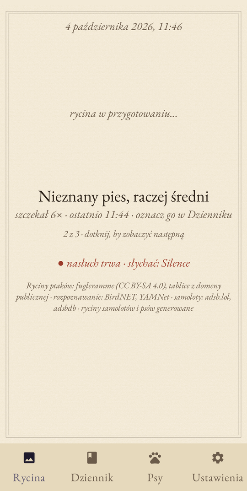
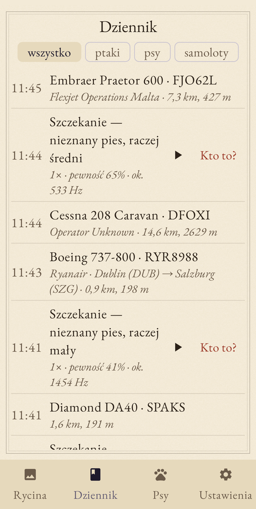
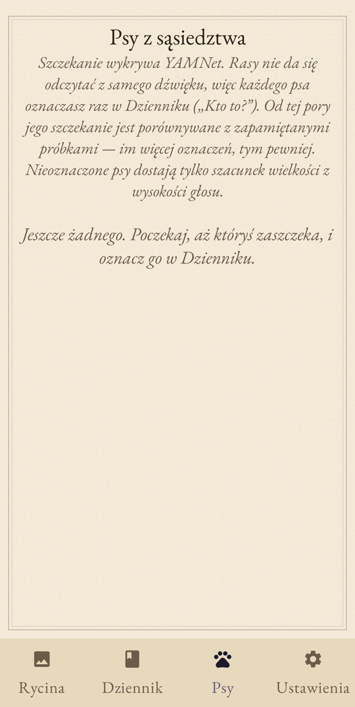
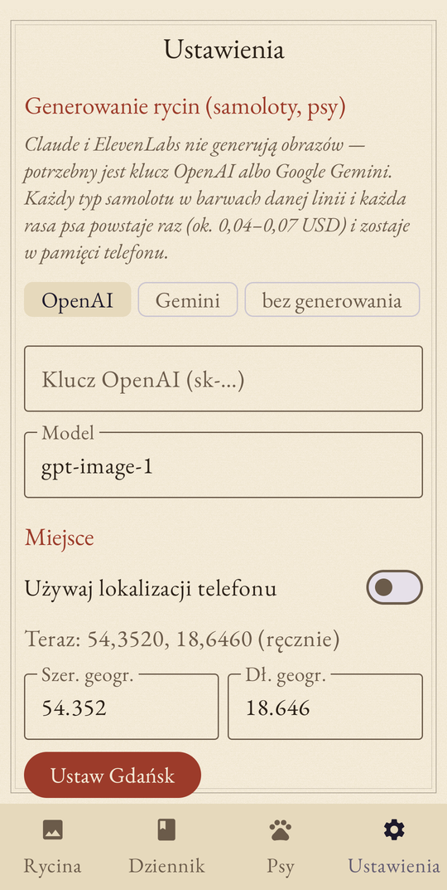

# Ryciny

Ramka w stylu [fugleramme](https://github.com/arnegiacomo/fugleramme): telefon cały czas słucha okolicy
i rysuje na „papierze” XIX-wieczne ryciny tego, co się dzieje wokół domu:

- **ptaki** rozpoznane po śpiewie (BirdNET 6K v2.4, w telefonie, z filtrem gatunków dla miejsca i pory roku),
- **samolot**, który właśnie przelatuje: typ, linia, rejestracja, trasa skąd-dokąd, wysokość i odległość
  (dane ADS-B z adsb.lol + adsbdb),
- **psy**, które szczekają w okolicy: wykrywanie szczekania (YAMNet), rozpoznawanie konkretnych psów
  z sąsiedztwa i ich ras,
- **dźwięki okolicy** (31 rodzajów, YAMNet): kosiarka i piła u sąsiada, burza, deszcz, wiatr, statki i syrena
  mgłowa z portu, dzwony kościelne, pociąg, motocykl, helikopter, karetka, policja, straż, fajerwerki, kot,
  kogut, zwierzęta gospodarskie, żaby, świerszcze, pszczoły, muzyka, dzwonek do drzwi, lodziarz. Każdy ma własną
  rycinę. Pełna lista z progami i promptami jest w [`shared/sounds.json`](shared/sounds.json). Mowa, płacz
  i inne ludzkie odgłosy są celowo pominięte: ramka słucha przyrody i ulicy, nie sąsiadów.

Na ekranie jest zawsze **jedna rycina**: najnowsza rzecz z okolicy (samolot nad głową, ostatni ptak,
ostatni pies albo ostatni dźwięk, np. kosiarka czy burza). Dotknięcie przełącza na następną, a gdy pojawi się coś nowego, ekran wraca do niej.

Etap 1 to aplikacja na Androida do testów. Etap 2 to Raspberry Pi z kolorowym ekranem e-ink, jak w fugleramme.

## Jak to wygląda

| Ptak | Samolot | Pies |
| :---: | :---: | :---: |
|  |  |  |
| Kos rozpoznany po śpiewie, tablica z fugleramme | Embraer Praetor 600 nad Gdańskiem: linia, rejestracja, wysokość, kierunek | Szczekający pies, wielkość zgadnięta z wysokości głosu |

| Dziennik | Psy | Ustawienia |
| :---: | :---: | :---: |
|  |  |  |
| Wszystko, co przeleciało, zaśpiewało i zaszczekało. Szczekanie można odsłuchać i oznaczyć („Kto to?”) | Psy oznaczone przez ciebie, z liczbą próbek | Klucz do generowania rycin, miejsce, progi |

Zrzuty pochodzą z pierwszego uruchomienia na Pixelu 9, jeszcze bez klucza do generowania obrazów, dlatego
samolot i pies mają napis „rycina w przygotowaniu…” zamiast ryciny. Ptaki mają gotowe tablice i nie potrzebują klucza.

## Instalacja na telefonie

Pobierz `ryciny-vX.Y.Z.apk` z [ostatniego wydania](../../releases/latest), prześlij go na telefon i otwórz.
Trzeba zezwolić na instalację z nieznanych źródeł. APK jest podpisany kluczem testowym (debug).

Ze źródeł:

```bash
cd android
./gradlew assembleRelease      # wymaga JDK 17 i Android SDK (compileSdk 37)
adb install -r app/build/outputs/apk/release/app-release.apk
```

Po starcie aplikacja prosi o mikrofon, lokalizację i powiadomienia. Nasłuch działa jako usługa w tle
z powiadomieniem „Ryciny nasłuchują” (stamtąd można go zatrzymać). Dźwięk nigdy nie opuszcza telefonu.

## Klucz do generowania rycin

Ptaki mają prawdziwe tablice z XIX wieku, wycięte ręcznie przez autora fugleramme (ponad 500 gatunków,
pobierane z jego repozytorium przy pierwszym użyciu). Samolotów i ras psów w takich tablicach nie ma,
więc aplikacja generuje je w tym samym stylu:

- **Claude (Anthropic) i ElevenLabs nie generują obrazów**, ich klucze tu nie pomogą.
- Działa klucz **OpenAI** (`gpt-image-1`) albo **Google Gemini** (`gemini-2.5-flash-image`).
  Wpisz go w Ustawieniach.
- Każdy typ samolotu w barwach danej linii (np. Embraer E175 LOT), każda rasa psa i każdy dźwięk okolicy powstają raz
  i zostają w telefonie. Nic nie jest generowane drugi raz: zamówiony obraz dokańcza się nawet po przełączeniu
  ekranu, a oryginał z API jest zapisywany przed wycinaniem tła. Ryciny minionych samolotów można też
  wygenerować z Dziennika (przycisk „Rycina” przy samolocie). Rycina kosztuje ok. 0,04–0,07 USD. Przy lotnisku w Gdańsku to kilkadziesiąt
  kombinacji, czyli w sumie kilka dolarów.
- Wygenerowany obraz jest wycinany z tła (PNG z przezroczystością, maks. 1200 px), czyli ma ten sam format
  co tablice fugleramme.

Prompty są w [`shared/style.json`](shared/style.json); zmień je, jeśli chcesz inny styl.

## Jak działa rozpoznawanie psów (i czego nie umie)

Żaden model nie rozpozna rasy psa z samego szczekania. Szczekanie owczarka i labradora brzmi podobnie,
a dwa jamniki mogą brzmieć zupełnie inaczej. Dlatego aplikacja robi to, co da się zrobić rzetelnie:

1. **Wykrywa szczekanie**: YAMNet (Google, AudioSet) ma klasy *Dog / Bark / Yip / Howl / Growling*.
2. **Szacuje wielkość** z wysokości głosu (duży < 380 Hz < średni < 650 Hz < mały). To tylko szacunek.
3. **Uczy się psów z sąsiedztwa**: w Dzienniku przy szczekaniu jest odtwarzanie i przycisk **„Kto to?”**.
   Oznaczasz psa raz (imię + rasa), a aplikacja zapisuje „odcisk” jego szczekania (1024-wymiarowe
   embeddingi YAMNet). Kolejne szczekania porównuje z zapisanymi próbkami (podobieństwo kosinusowe,
   próg w Ustawieniach, domyślnie 85%). Im więcej oznaczeń danego psa, tym pewniej go rozpoznaje.

Rasa na rycinie to ta, którą wpiszesz przy oznaczaniu psa. Nieoznaczony pies jest rysowany jako kundel
zgadniętej wielkości. Próg dopasowania trzeba będzie pewnie dostroić na prawdziwych psach: jeśli myli psy,
podnieś go, a jeśli nie poznaje znanych, obniż albo oznacz więcej próbek.

## Samoloty

- Pozycje: [adsb.lol](https://adsb.lol) (społecznościowa sieć ADS-B, bez klucza), odpytywane co 10 s,
  tylko gdy ekran jest włączony albo działa nasłuch.
- Typ, linia i trasa: [adsbdb.com](https://www.adsbdb.com). Trasy są przypisane do numeru lotu, więc
  czasem bywają nieaktualne.
- „Nad głową” to najbliższy samolot w linii prostej poniżej ustawionej wysokości (domyślnie 3500 m,
  promień 15 km). Pozostałe są wypisane drobnym drukiem.
- Gdy mikrofon usłyszy silnik odrzutowy albo śmigło (YAMNet *Aircraft / Jet engine*), przy samolocie
  pojawia się napis „słychać go teraz”, a w Dzienniku przelot jest oznaczony jako słyszany.

Lokalizacja: GPS telefonu. Bez GPS aplikacja używa współrzędnych z Ustawień (domyślnie centrum Gdańska).
Filtr gatunków BirdNET jest liczony dla tego miejsca i tygodnia roku.

## Struktura

```
shared/                 wspólne dla Androida i Pi
  style.json            prompty rycin
  sounds.json           dźwięki okolicy: klasy YAMNet, progi, prompty
  dog_breeds.json       rasy (pl + en do promptu)
  aircraft_types.json   kody ICAO typów -> nazwy
android/app/src/main/java/pl/wojczal/ryciny/
  audio/                AudioRecord 48 kHz -> okna 3 s -> Analyzer (BirdNET + YAMNet), usługa w tle
  ml/                   BirdNET, filtr zasięgu, YAMNet (LiteRT)
  planes/               adsb.lol + adsbdb
  art/                  tablice fugleramme, generowanie (OpenAI/Gemini), wycinanie z tła
  data/                 dziennik (JSON), psy, ustawienia, eksport dla Pi
  ui/                   rycina, dziennik, psy, ustawienia
```

## Etap 2: Raspberry Pi + kolorowy e-ink

Plan: nie przepisywać fugleramme, tylko dołożyć do niego dwa źródła.

| Element | Telefon (teraz) | Raspberry Pi (etap 2) |
| --- | --- | --- |
| Ptaki | BirdNET v2.4 w aplikacji | BirdNET-Go (to samo v2.4), tak jak w fugleramme |
| Psy | YAMNet + embeddingi | ten sam `yamnet.tflite` w Pythonie (ai-edge-litert), te same embeddingi, więc nauczone psy przechodzą 1:1 |
| Samoloty | adsb.lol przez internet | adsb.lol albo własny odbiornik RTL-SDR + readsb (ok. 150 zł, działa bez internetu i widzi więcej) |
| Ryciny | generowane na telefonie | wczytane z eksportu, bez ponownego generowania |
| Ekran | Compose | renderer fugleramme -> Inky Impression 13.3" (Spectra 6) |

Przejście:
1. W aplikacji: **Ustawienia → Eksportuj (ZIP)**. Paczka zawiera `artwork/ryciny/{planes,dogs,birds}/*.png`
   (format stylu fugleramme), `dogs.json` z próbkami szczekania, `journal.json` i pliki z `shared/`.
2. Na Pi: fugleramme + BirdNET-Go według ich instrukcji.
3. Dopisać do fugleramme dwa moduły źródeł: `sky.py` (port `planes/Sky.kt`) i `dogs.py` (YAMNet na tym
   samym strumieniu z mikrofonu, port `audio/Analyzer.kt` + `Dsp.kt`). Fugleramme już teraz wyrzuca etykietę
   BirdNET „Dog” w `taxa.py`, więc pies to jedyne miejsce, gdzie trzeba sięgnąć poza BirdNET-Go.
4. Rozszerzyć kolaż fugleramme o pas „niebo” (samolot) i „psy”.

## Wersje

Numeracja `MAJOR.MINOR.PATCH`. Wersja jest w jednym miejscu: `android/gradle.properties` (`ryciny.version`),
a `versionCode` Androida wylicza się z niej (0.1.0 → 100). Każde wydanie ma tag `vX.Y.Z` i release na GitHubie
z plikiem APK. Lista zmian: [CHANGELOG.md](CHANGELOG.md).

Nowe wydanie:

```bash
# podbij ryciny.version w android/gradle.properties i dopisz wpis w CHANGELOG.md
cd android && ./gradlew assembleRelease
cp app/build/outputs/apk/release/app-release.apk ryciny-v0.2.0.apk
git tag v0.2.0 && git push --tags
gh release create v0.2.0 ryciny-v0.2.0.apk --notes-file <(sed -n '/## 0.2.0/,/## 0.1/p' ../CHANGELOG.md)
```

## Licencje

- Kod: na razie bez licencji (wszystkie prawa zastrzeżone).
- Ryciny ptaków: [fugleramme](https://github.com/arnegiacomo/fugleramme), CC BY-SA 4.0, z tablic
  w domenie publicznej (Gould, von Wright i inni). Lista źródeł jest w `manifest.json` stylu *classic*.
- BirdNET v2.4 (modele i etykiety): CC BY-NC-SA 4.0, K. Lisa Yang Center for Conservation Bioacoustics.
  Tylko do użytku niekomercyjnego.
- YAMNet: Apache 2.0. EB Garamond: OFL. `birdnet_aliases.json`, `bird_sizes.csv`: z fugleramme / OpenFauna, CC BY-SA 4.0.
